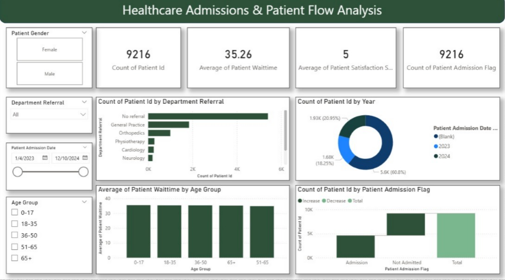
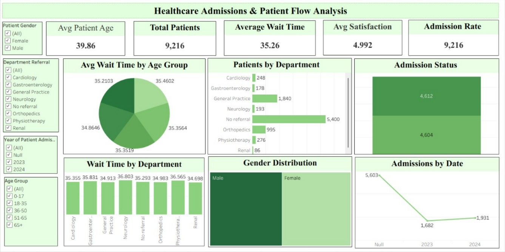
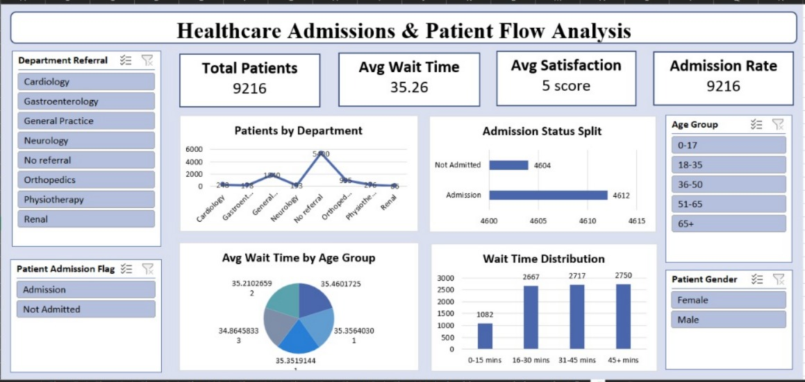

# 🏥 Healthcare Admissions & Patient Flow Analysis

## 📌 Executive Summary
This end-to-end healthcare analytics project analyzes hospital admission and patient flow data to identify operational inefficiencies, admission trends, department workload distribution, and patient experience metrics.  

The objective is to enable data-driven decision-making for optimizing hospital resource utilization and improving patient satisfaction.

---

## 🎯 Problem Statement
Hospitals often face challenges such as:
- Long patient wait times
- Uneven department workload distribution
- Inefficient resource allocation
- Limited visibility into admission trends

This project addresses these challenges through structured data analysis and interactive dashboards.

---

## 🛠️ Tools & Technologies
- **SQL** – Data cleaning, transformation, joins, aggregations, KPI calculations  
- **Excel** – Data preprocessing, pivot analysis, KPI modeling  
- **Power BI** – Interactive dashboards, DAX measures, KPI visualization  
- **Tableau** – Visual analytics and comparative trend analysis  

---

## 📊 Key Performance Indicators (KPIs)
- **Total Patients:** 9,216  
- **Average Patient Age:** 39.86 years  
- **Average Wait Time:** 35.26 minutes  
- **Average Satisfaction Score:** 4.99 / 5  
- Department-wise Patient Volume  
- Admission Status Distribution  
- Wait Time by Age Group  
- Year-wise Admission Trends  

---

## 📈 Dashboard Highlights

### 🔹 Power BI Dashboard

### 🔹 Tableau Dashboard

### 🔹 Excel Dashboard

---

## 🔍 Key Analytical Insights
- Highest patient inflow observed in **General Practice** and **No Referral** categories.  
- Wait times remain consistent (~35 minutes), indicating process stability but scope for optimization.  
- Gender distribution is balanced, ensuring demographic neutrality.  
- Admission trends fluctuate across years, suggesting seasonal or operational impacts.  
- Data reveals opportunities to redistribute workload across departments to reduce congestion.

---

## 💼 Business Impact
This analysis provides actionable insights to:
- Reduce patient wait times  
- Improve departmental resource planning  
- Optimize staff allocation  
- Enhance patient satisfaction  
- Support strategic healthcare decision-making  

---

## 🚀 Skills Demonstrated
- Data Cleaning & Validation  
- SQL Query Development & Aggregation  
- KPI Design & Performance Tracking  
- Dashboard Development (Power BI & Tableau)  
- Business Insight Communication  
- Analytical Problem Solving  

---

## 👩‍💻 Author
**Neethu Mariyam Sajan**  
Aspiring Data Analyst  
SQL | Power BI | Excel | Tableau  
